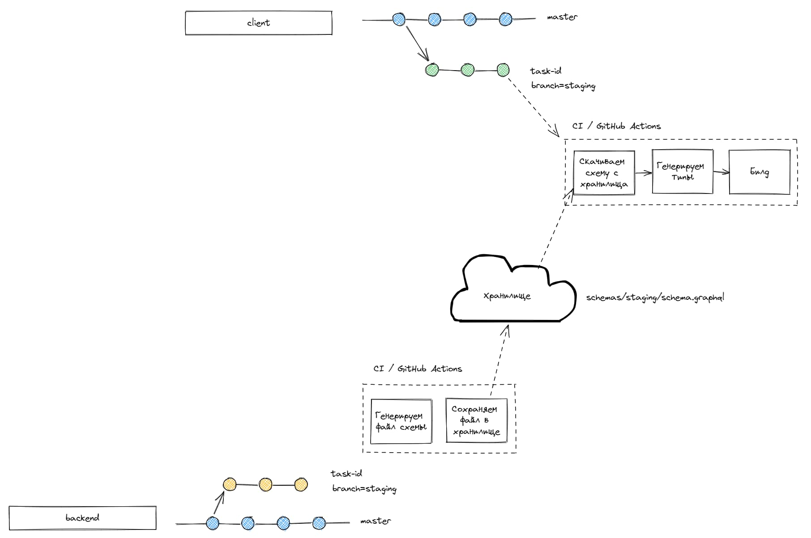

## Флоу CI
- При создании ПР с базовой веткой `staging` или `master` или пуше в эти ветки запускается воркфлоу Github Actions
- Если ветка `master` или `staging` -> создаем файл схемы `schema.graphql`
- Выгружаем файл схемы в хранилище в соответсвии с названием веток.
- Если ветка отличная от вышеуказанных -> загружаем файл для окружения по умолчанию (`staging`).

Переменные лежат в секретах репозитория.

Хранилище - firebase storage.

## Установка зависимостей
```sh
npm ci
```

## Создание файла схемы
```sh
npm run schema:make
```

## Загрузка файла схемы в хранилище
```sh
npm run schema:upload
```

## Запуск в режиме разработки
```sh 
npm start
```

## Общая схема CI
